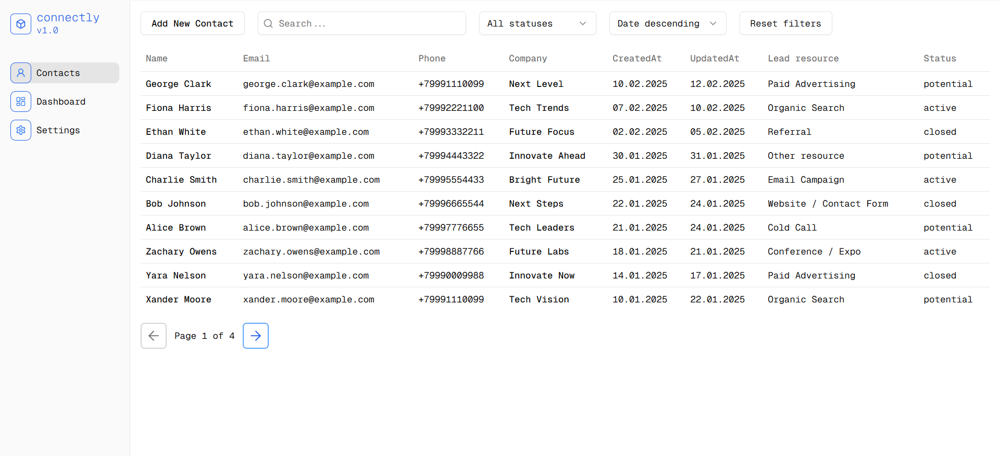

# Connectly v1.0

## Содержание

- [О проекте](#о-проекте)
- [Установка и запуск](#установка-и-запуск)
- [Технологический стек](#технологический-стек)
- [Возможности](#возможности)
- [Ссылка на проект](#Ссылка-на-проект)

## О проекте

Этот проект представляет собой CRM систему для работы с контактами клиентов, разработанное с использованием React и развернутое на Vercel.



## Установка и запуск

1. **Клонирование репозитория**:

```sh
git clone https://github.com/smolinartem/connectly
```

2. **Установка зависимостей:**

```sh
cd connectly
npm install
```

3. **Запуск приложения:**

```sh
npm run dev
```

## Технологический стек:

- React
- Typescript
- React Router
- React Hook Forms
- Zod
- Zustand
- Tailwind CSS
- Shadcn

## Возможности:

- добавление, редактирование и удаление контактов
- отображение всех контактов в виде таблицы
- поиск контактов по имени или адресу электронной почты
- фильтрация контактов по статусу
- сортировка контактов по дате
- пагинация по таблице контактов
- просмотр сведений о контакте на новой странице
- добавление заметок для каждого контакта
- просмотр статистики на панели управления

## Ссылка на проект:

- [Проект на Vercel](https://connectly-krutopognali.vercel.app/)
